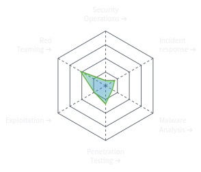

<h2 style="text-decoration: none; font-weight: bold;">HI, I'm NeoVirex (Abr-ahamis)</h2>

I'm a passionate and motivated individual with a deep interest in technology and cybersecurity. Having recently graduated, I am enthusiastic about applying my skills in penetration testing and security analysis. I am eager to leverage my knowledge to tackle real-world security challenges and contribute to safeguarding digital environments.

<h2>🎯 Objective</h2>

Aspiring to become a Security Tester and Security Analyst.

 

<h2>📊 Skill Mastery & TryHackMe Stats</h2>

<table>
  <tr>
    <td>
      <h3>🛠️ Skill Mastery</h3>
      
    </td>
    <td align="center">
      
        
      
      
      
      
    </td>
  </tr>
</table>

<h2>🔧 Skills & Expertise</h2>

<table>
  <tr>
    <th>Phase</th>
    <th>Focus Areas & Learning Objectives</th>
    <th>Example CTFs</th>
  </tr>
  <tr>
    <td>Reconnaissance & Service Enumeration</td>
    <td>OSINT, Nmap, Masscan</td>
    <td>Lookup, Fowsniff CTF</td>
  </tr>
  <tr>
    <td>Web Application Analysis</td>
    <td>Burp Suite; OWASP Juice Shop (Injection, Broken Auth, XSS, …)</td>
    <td>OWASP Juice Shop, Bypass Disable Functions</td>
  </tr>
  <tr>
    <td>Vulnerability Scanning</td>
    <td>Nikto, OpenVAS</td>
    <td>Easy Peasy, SMOL</td>
  </tr>
  <tr>
    <td>Exploit & Initial Access</td>
    <td>Metasploit, custom Python scripts</td>
    <td>Pickle Rick, Crack the hash</td>
  </tr>
  <tr>
    <td>Privilege Escalation</td>
    <td>LinPEAS, Windows‑Exploit‑Suggester</td>
    <td>RootMe, Robots</td>
  </tr>
  <tr>
    <td>Lateral Movement</td>
    <td>SMB pivoting, SSH tunneling</td>
    <td>Hackfinity Battle Encore, Rabbit Store</td>
  </tr>
</table>

<h2>🛠️ Tools</h2>

<h3>Network Tools</h3>

  
  
  

<h3>Endpoint Tools</h3>

  
  
  
  
  

<h3>SIEM Tools</h3>

  
  
  

<h2>📜 Certifications</h2>

  
  
  
  

<h2>🧾 Projects & Write-Ups</h2>

<ul>
  <li><strong>🔓 <a href="https://github.com/Abr-ahamis/Firewall-project">Auth Bypass Toolkit</a></strong> – A custom toolkit in Python/Flask for session hijacking and auth bypass in web apps.</li>
  <li><strong>🐍 <a href="https://github.com/Abr-ahamis/Image-Stego-Encryptor">Python Exploit Scripts</a></strong> – Collection of automated exploit scripts used across multiple CTF rooms.</li>
  <li><strong>🌐 <a href="https://github.com/Abr-ahamis/WebScanner">WebScanner</a></strong> – Minimal example scanners to understand OWASP Top 10 vulnerabilities.</li>
  <li><strong>🌐 <a href="https://github.com/Abr-ahamis/Python-and-C-Keyloggers">Keylogger</a></strong> – A Go/JavaScript keylogger learning project.</li>
  <li><strong>🔍 <a href="https://github.com/Abr-ahamis/Network.py">Traffic Analyzer</a></strong> – Wireshark/Scapy‑powered tool for deep packet inspection in CTFs.</li>
</ul>
